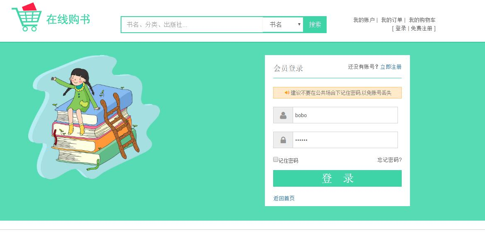
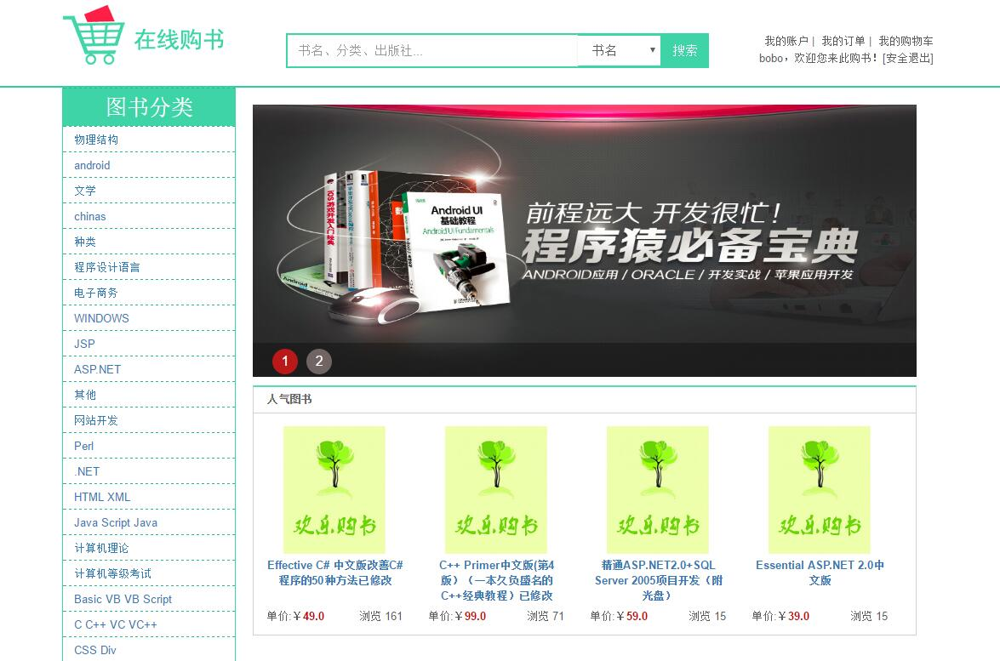
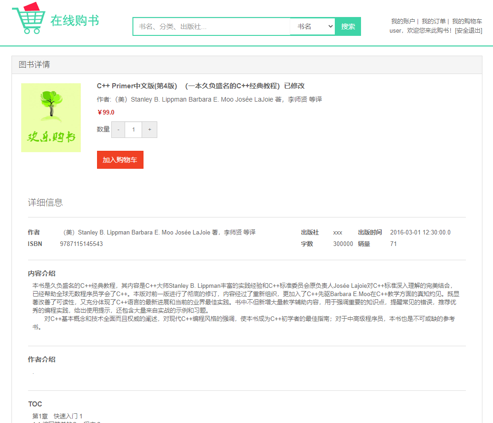
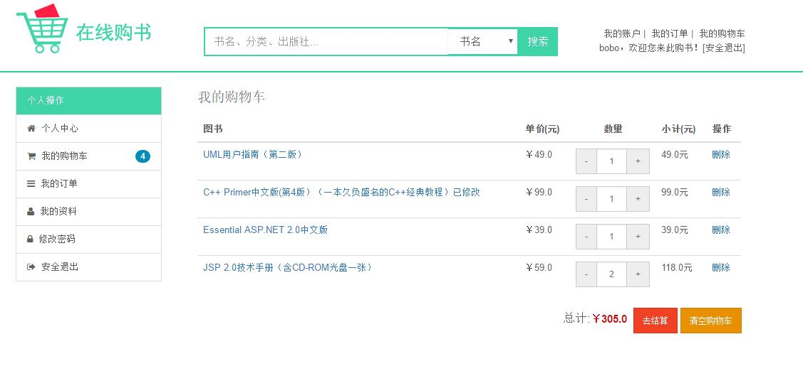
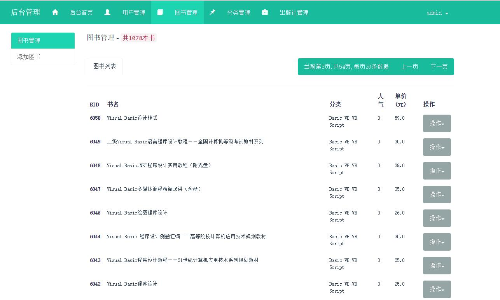
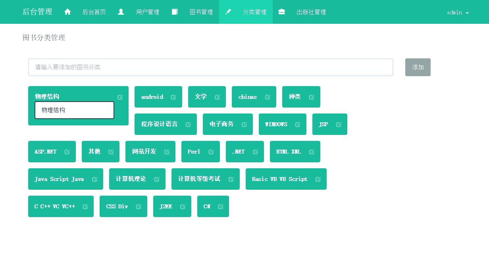

# 介绍

> 这不是一个完整的项目，开源出来供 JavaWeb 初学者参考学习，项目代码很简洁，注释也还ok~

这是我在2015年刚开始学习JavaWeb开发时，使用 JSP + Servlet + Mysql 实现的一个非常简单的购书项目，包含**管理端**和**用户端**，主要目的是对所学的Servlet进行实践操作。  

管理端功能模块：  

- 用户管理
- 图书管理
- 分类管理

用户端功能模块：  

- 用户信息
- 图书浏览
- 购物车
- 订单

# 技术栈

- JSP
- Servlet
- dbcp 连接池
- Bootstrap 前端框架

# 本地运行

运行环境要求:

- Eclipse EE
- JDK 1.8+  
- Tomcat 8.5+  
- Mysql 5.7+  

## 1. 使用 Eclipse 打开项目

执行Eclipse菜单：File > Open Projects From File System... > Directory... > 选择项目目录 > Finish

项目使用utf8编码

## 2. 导入数据表

将 sql 目录下的 mybookshop.sql 数据导入到现有 Mysql 数据库中

## 3. 配置数据库连接

修改数据库配置文件中的参数，在：WebContent/WEB-INF/db.properties

## 4. 使用Tomcat运行项目

用户端访问地址：http://localhost:8080/book-shop   账号：user/user
管理端访问地址：http://localhost:8080/book-shop/admin/login.jsp   账号：admin/admin

# 部分截图

- 用户登录

- 首页

- 图书详情

- 购物车

- 后台-图书列表

- 后台-图书分类

